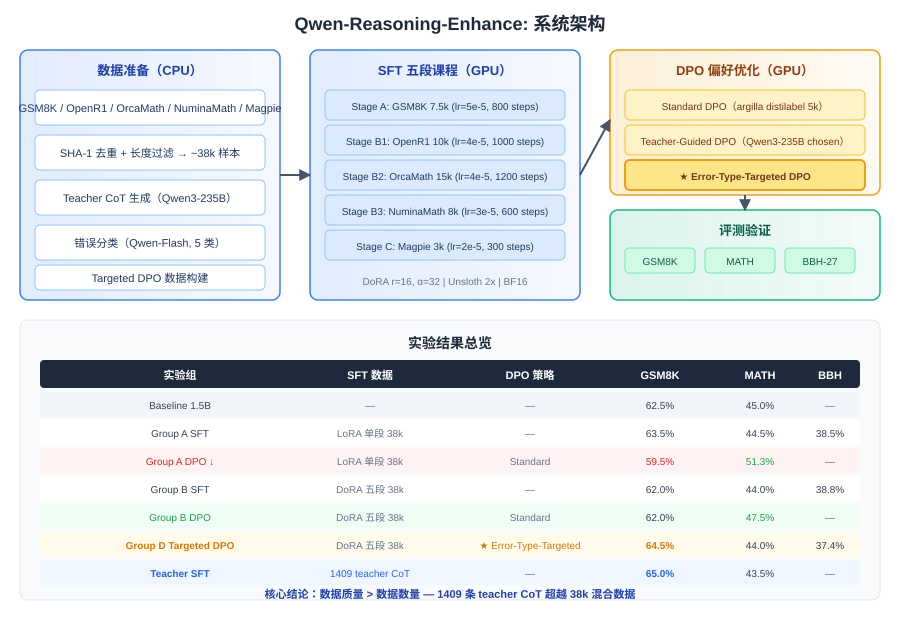

# Qwen-Reasoning-Enhance

> **目标**：在 **Qwen2.5-1.5B-Instruct**（1.5B 参数）上，通过数据课程学习与诊断式偏好优化，提升数学推理能力。

> **核心发现**：数据质量 > 数据数量 — 1409 条高质量 teacher CoT 数据（65.0% GSM8K）超越 38k 混合数据 SFT（62.0%）。

---

## 项目概览

1.5B 模型在 GSM8K 上 baseline 仅 62.5%，与 7B（84.5%）存在 22pp 差距。本项目探索**数据驱动**的方法缩小这一差距，核心工作包括：

1. **五段式 SFT 课程**：从 in-distribution 到 broad reasoning 的渐进式训练（~38k 样本）
2. **Error-Type-Targeted DPO**（创新点）：先诊断错误类型（5 类），再用类型专属 prompt 生成纠正样本
3. **Teacher SFT 蒸馏**：用 Qwen3-235B 生成 1409 条高质量 CoT，验证质量 > 数量
4. **多组消融实验**：6 组实验对比 SFT 数据策略、PEFT 方法、DPO 策略

---

## 实验结果

| 实验组 | 配置 | GSM8K | MATH-500 | BBH-27 |
|---|---|---|---|---|
| Baseline 1.5B | — | 62.5% | 45.0% | — |
| 7B（参考） | — | 84.5% | 68.0% | — |
| Group A SFT | LoRA + 单段 38k | 63.5% | 44.5% | 38.5% |
| Group A DPO | + Standard DPO | 59.5% | 51.3% | — |
| Group B SFT | DoRA + 五段课程 | 62.0% | 44.0% | 38.8% |
| Group B DPO | + Standard DPO | 62.0% | 47.5% | — |
| **Group D** | + **Error-Type-Targeted DPO** | **64.5%** | 44.0% | 37.4% |
| **Teacher SFT** | 1409 teacher CoT | **65.0%** | 43.5% | — |

评测协议：chat-template + zero-shot，n=200，95% CI ±6.9pp。

---

## 关键发现

### 1. Teacher SFT：质量 > 数量

1409 条 Qwen3-235B teacher CoT 达到 65.0% GSM8K，超越 38k 混合数据的 A/B SFT（62-63.5%）和 Targeted DPO（64.5%）。验证了 DeepSeek-R1-Distill 的核心洞察。

### 2. Error-Type-Targeted DPO 定向有效

SFT 模型的 badcase 分析显示 setup_error 占 65%（读错题意）。针对 GSM8K badcase 的 Targeted DPO 提升 +2.5pp，但对 MATH 无定向优化（-3.5pp，属于轻微遗忘）。

### 3. DPO 基座稳定性至关重要

Group A（单段 SFT）做 DPO 后 GSM8K 回退 -4.0pp；Group B（五段课程）做 DPO 后持平。五段课程提供的稳定基座是 DPO 成功的前提。

### 4. 数据选择与 badcase 分析比模型架构更重要

整个项目的迭代过程表明：数据质量过滤、错误类型诊断、定向数据构建带来的收益，远大于 PEFT 方法（LoRA vs DoRA）或 DPO loss 变体（sigmoid vs IPO）的差异。

---

## 迭代历程

```
v1（LoRA + 单段 SFT + 错误 DPO）  → GSM8K 40.0% ❌ DPO 灾难性回退
   ↓ 教训：DPO 数据质量是前提
v2（DoRA + 两段课程 + 修复 DPO）   → ~55%
   ↓ 教训：训练-测试分布错位
v3（in-distribution 对齐 + 错误分类）→ ~60%
   ↓ 教训：缺少 MATH 评测和推理深度
v4（三剑客课程 + Targeted DPO）     → 65.0% ✅
   ↓ Teacher SFT 蒸馏验证质量 > 数量
```

每一轮失败都产生了有价值的教训，详见 [`AI2AI.md`](AI2AI.md)。

---

## 架构



**两层流水线**：
- **CPU 层**：数据下载、去重、错误分类、Targeted DPO 数据构建
- **GPU 层**：SFT 五段课程训练、DPO 训练、LoRA 合并、评测

**PEFT 配置**：DoRA r=16, α=32, 7 target modules, 18.4M 可训练参数（1.18%）。

---

## 项目结构

```
├── config/                     # 训练配置（SFT/DPO/benchmark）
├── scripts/                    # 核心脚本
│   ├── prepare_data.py         # 数据下载 + 去重 + 过滤
│   ├── sft_train.py            # SFT 五段课程训练
│   ├── dpo_train.py            # DPO（支持 weighted loss）
│   ├── classify_errors.py      # Badcase 5 类错误分类
│   ├── build_targeted_dpo.py   # Error-Type-Targeted DPO 数据构建
│   ├── build_teacher_dpo.py    # Teacher-Guided DPO 数据构建
│   └── merge_lora.py           # LoRA/DoRA 合并
├── eval/                       # 评测脚本
│   ├── gsm8k_eval.py / math_eval.py / bbh_eval.py
│   ├── compare_table.py        # 结果对比表
│   └── visualize.py            # 可视化
├── notebooks/                  # Colab 训练/评测 notebook
├── data/processed/             # 训练数据（gitignore 大文件）
├── logs/                       # 评测结果 JSON + badcase
├── docs/                       # 项目文档（设计/实验/分析/参考/汇报）
├── AI2AI.md                    # 迭代记录
└── me2AI.md                    # 完整架构与设计文档
```

---

## 快速开始

### 环境

```bash
cp .env.example .env
# 填写 DASHSCOPE_API_KEY / HF_TOKEN

python3 -m venv .venv && source .venv/bin/activate
pip install -r requirements-macos.txt
```

### 数据准备（本地，无需 GPU）

```bash
bash run_local.sh              # 完整流水线（~1-2h）
bash run_local.sh --quick      # 快速测试（500 samples, ~15min）
```

### 训练 + 评测（GPU）

```bash
bash run_gpu.sh                # 完整：SFT → DPO → 评测
```

### 生成对比表

```bash
python3 eval/compare_table.py
python3 eval/visualize.py --metrics_json logs/compare_metrics.json --out_dir eval/figures
```

---

## 局限性

- 评测样本量小（n=200, CI ±6.9pp），<5pp 的差异无统计显著性
- 自定义评测协议（zero-shot），与 Qwen 官方 lm-evaluation-harness（8-shot）存在系统性偏差
- Targeted DPO 数据量小（420 条），E14 还在进行中
- 仅在 Qwen2.5-1.5B 上验证，未扩展到其他模型

---

## 文档

| 文档 | 内容 |
|---|---|
| [`docs/01_design.md`](docs/01_design.md) | 整体设计方案与架构 |
| [`docs/02_experiments.md`](docs/02_experiments.md) | 全部实验记录（参数、结果）|
| [`docs/03_analysis.md`](docs/03_analysis.md) | Badcase 分析与改进方向 |
| [`docs/04_references.md`](docs/04_references.md) | 参考文献（25 篇）|
| [`docs/05_report.md`](docs/05_report.md) | 汇报材料（PPT 大纲）|
| [`docs/06_summary.md`](docs/06_summary.md) | 项目总结 |
| [`AI2AI.md`](AI2AI.md) | 迭代记录 |
| [`me2AI.md`](me2AI.md) | 完整设计文档 |

---

## 参考文献

- [DeepSeek-R1](https://arxiv.org/abs/2501.12948) · [Qwen2.5](https://arxiv.org/abs/2412.15115)
- [DPO](https://arxiv.org/abs/2305.18290) · [DoRA](https://arxiv.org/abs/2402.09353)
- [Step-DPO](https://arxiv.org/abs/2406.18629) · [Let's Verify Step by Step](https://arxiv.org/abs/2305.20050)
- [GSM8K](https://arxiv.org/abs/2110.14168) · [MATH](https://arxiv.org/abs/2103.03874) · [BBH](https://arxiv.org/abs/2210.09261)
- [Unsloth](https://github.com/unslothai/unsloth) · [TRL DPOTrainer](https://huggingface.co/docs/trl/dpo_trainer)
