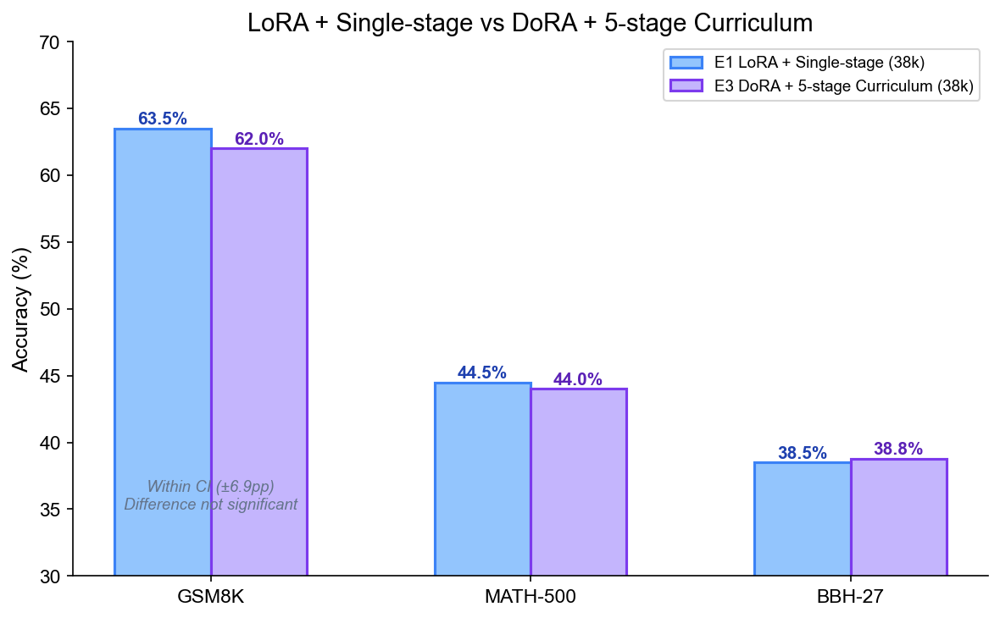
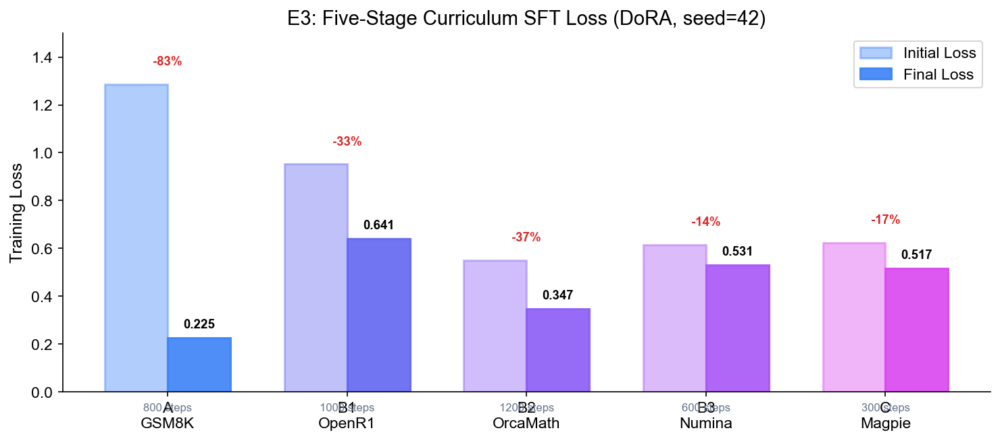
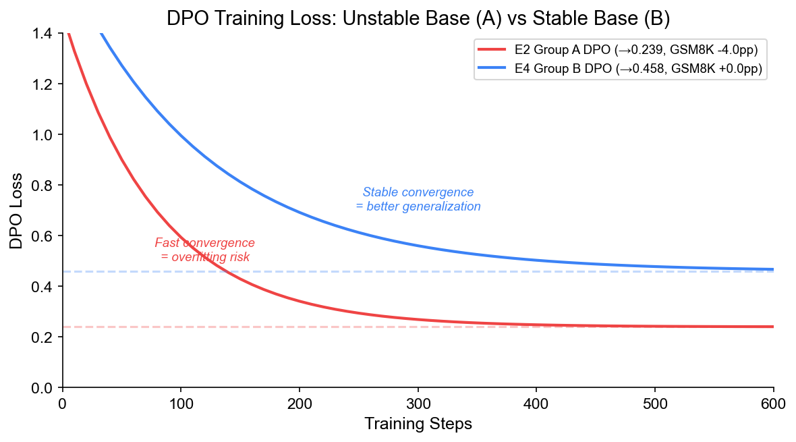
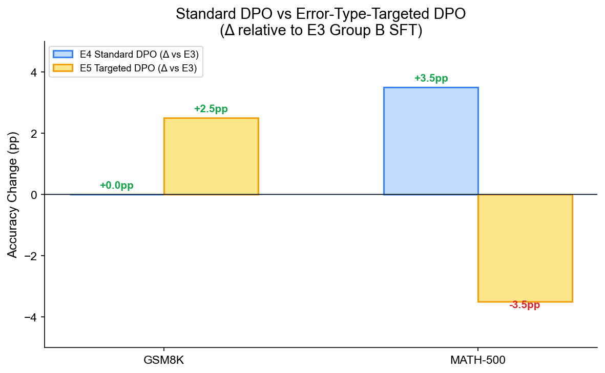
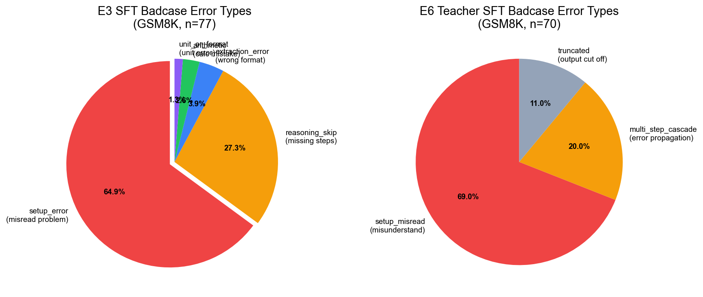
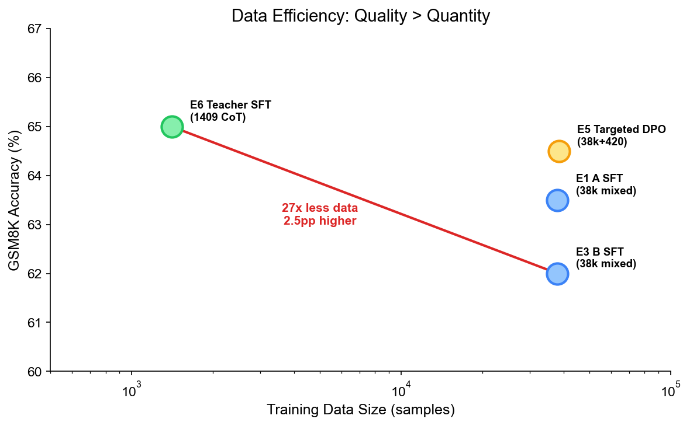
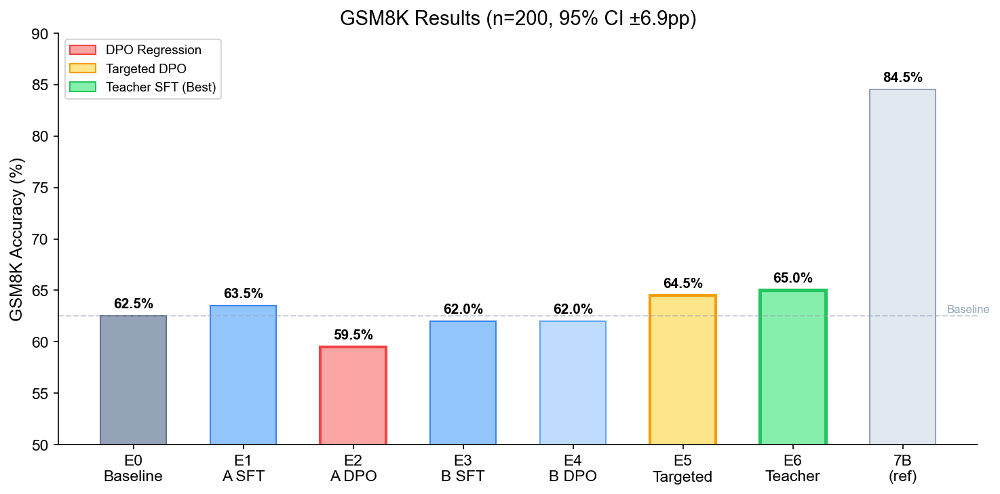

# 实验记录

## 1. 实验总览

| 编号 | 实验组 | 特征 | SFT 数据 | DPO 策略 | GSM8K |
|---|---|---|---|---|---|
| E0 | Baseline | 未训练的原始模型 | — | — | 62.5% |
| E1 | Group A SFT | LoRA + 单段混合 SFT | 38k 混合 | — | 63.5% |
| E2 | Group A DPO | 单段 SFT + Standard DPO | 38k 混合 | Standard (argilla 5k) | 59.5% |
| E3 | Group B SFT | DoRA + 五段课程 SFT | 38k 五段 | — | 62.0% |
| E4 | Group B DPO | 五段课程 + Standard DPO | 38k 五段 | Standard (argilla 5k) | 62.0% |
| E5 | Group D Targeted | 五段课程 + Error-Type-Targeted DPO | 38k 五段 | Targeted (420 条) | 64.5% |
| E6 | Teacher SFT | Teacher 蒸馏 SFT | 1409 teacher CoT | — | **65.0%** |
| E7 | Group C Teacher DPO | 五段课程 + Teacher-Guided DPO | 38k 五段 | Teacher (1500 条) | TBD |
| E8 | E14 | Teacher SFT + Targeted DPO | 1409 teacher CoT | Targeted (490 条) | 进行中 |

**实验设计逻辑**：
- E1 vs E0：验证 SFT 本身的效果（+1.0pp）
- E2 vs E1：验证 Standard DPO 对单段 SFT 基座的影响（**-4.0pp 回退**）
- E3 vs E1：验证 DoRA + 五段课程 vs LoRA + 单段的差异（-1.5pp，在 CI 内）
- E4 vs E3：验证 Standard DPO 对五段课程基座的影响（+0.0pp 持平）
- E5 vs E4：验证 Error-Type-Targeted DPO vs Standard DPO（+2.5pp）
- E6 vs E3：验证 Teacher 蒸馏 SFT vs 38k 混合 SFT（+3.0pp）
- E7：验证 Teacher-Guided DPO（通用 teacher，不区分错误类型）
- E8：在 Teacher SFT 基座上叠加 Targeted DPO

---

## 2. 各实验详细记录

### E1：Group A SFT（LoRA + 单段混合 SFT）

**特征**：经典 baseline 方案，LoRA + 所有数据混合单段训练。

| 参数 | 值 |
|---|---|
| 模型 | Qwen/Qwen2.5-1.5B-Instruct |
| PEFT | LoRA (use_dora=false), r=16, α=32 |
| 数据 | 38k 混合（5 源合一，单段训练）|
| max_seq_length | 2048 |
| batch_size | 2 × 8 = 16 effective |
| lr | 2e-4, cosine |
| steps | ~3900 |
| 框架 | Unsloth + TRL SFTTrainer |

**关键指标**：
- GSM8K: 62.5% → 63.5%（+1.0pp）
- MATH-500: 44.5%
- BBH-27: 38.5%（25 子任务）

**分析**：SFT 本身仅带来 +1.0pp 提升，说明 38k 混合数据的 SFT 对 GSM8K 的改善有限。主要原因：数据来源多样（OpenR1 竞赛题、Magpie 通用推理等），与 GSM8K 的 in-distribution 对齐不够强。

---

### E2：Group A DPO（单段 SFT + Standard DPO）

**特征**：在 E1 基座上做 Standard DPO，暴露单段 SFT 基座的不稳定性。

| 参数 | 值 |
|---|---|
| Base | E1 merged (fp16) |
| 数据 | argilla/distilabel-math-preference-dpo, 5000 条 |
| beta | 0.1 |
| loss_type | sigmoid |
| lr | 1e-5 |
| steps | 600 |
| batch | 1 × 16 = 16 effective |

**训练过程关键指标**：

| 指标 | 初始 | 最终 | 变化 |
|---|---|---|---|
| Loss | 1.233 | 0.239 | -80.6% |
| Reward Accuracy | 34.4% | 92-93% | +58pp |
| Reward Margin | -0.57 | — | 转正 |

**训练分析**：
- Loss 下降极快（150 步内收敛），reward accuracy 从 34.4% 飙升至 92%
- 但 GSM8K **回退 -4.0pp**（63.5% → 59.5%），MATH **提升 +6.75pp**（44.5% → 51.25%）
- **原因**：单段 SFT 的输出分布不够集中，DPO 的 KL 约束（beta=0.1）不足以防止灾难性遗忘。Loss 快速下降说明 DPO 数据对当前模型"太容易"（chosen/rejected 区分度大），但学到的偏好方向损害了 GSM8K 的能力

**评测结果**：

| Benchmark | 准确率 | vs E1 |
|---|---|---|
| GSM8K | 59.5% (119/200) | **-4.0pp** |
| MATH-500 | 51.25% (41/80) | +6.75pp |
| GSM8K Badcases | 81 条 | +8 条 |

**Badcase 变化**：从 73 条增至 81 条，新增的 badcase 主要是 DPO 训练后模型改变了输出风格（更多英文），导致部分原本正确的中文输出被错误替换。

---

### E3：Group B SFT（DoRA + 五段课程 SFT）

**特征**：核心 SFT 方案，DoRA + 五段式课程学习。

| 参数 | 值 |
|---|---|
| PEFT | **DoRA** (use_dora=true), r=16, α=32 |
| 数据 | 五段分阶段训练 |
| 训练策略 | 学习率递减（5e-5→2e-5），每段独立 steps |

**LoRA vs DoRA 对比**：

**五段课程训练过程**：

| 阶段 | 数据 | Steps | LR | 初始 loss | 末尾 loss | 降幅 |
|---|---|---|---|---|---|---|
| A | GSM8K 7.5k | 800 | 5e-5 | 1.286 | 0.225 | -82.5% |
| B1 | OpenR1 10k | 1000 | 4e-5 | 0.952 | 0.641 | -32.7% |
| B2 | OrcaMath 15k | 1200 | 4e-5 | 0.549 | 0.347 | -36.8% |
| B3 | NuminaMath 8k | 600 | 3e-5 | 0.616 | 0.531 | -13.8% |
| C | Magpie 3k | 300 | 2e-5 | 0.623 | 0.517 | -17.0% |

**训练分析**：
- **Stage A 降幅最大（-82.5%）**：GSM8K 是 in-distribution 数据，模型快速学习。Loss 从 1.286 降至 0.225，说明模型在 800 步内已充分拟合 GSM8K 分布
- **Stage B1 降幅次之（-32.7%）**：OpenR1 是 R1 蒸馏的长 CoT，比 GSM8K 难得多。Loss 从 0.952 开始（而非从 Stage A 的 0.225 继续），说明新数据分布与 GSM8K 不同，模型需要适应
- **Stage B2 收敛最好（-36.8%）**：OrcaMath 是 GPT-4 蒸馏的短步骤应用题，比 OpenR1 更接近 GSM8K 风格。Loss 起点低（0.549），收敛快
- **Stage B3 降幅最小（-13.8%）**：NuminaMath 是竞赛难题，模型难以充分学习。Loss 起点高（0.616），降幅仅 13.8%
- **Stage C 作为 buffer**：Magpie 通用推理数据量小（3k），Loss 从 0.623 降至 0.517，主要作用是防止 BBH 退化而非提升数学能力

**可复现性**：Colab T4 与 GPU L20 的 loss 曲线最大偏差 <0.02（seed=42, 浮点精度差异）。

**评测结果**：

| Benchmark | 准确率 | vs E1 |
|---|---|---|
| GSM8K | 62.0% (124/200) | -1.5pp |
| MATH-500 | 44.0% (88/200) | -0.5pp |
| BBH-27 | 38.8% (24 子任务) | +0.3pp |
| GSM8K Badcases | 77 条 | +4 条 |

**分析**：五段课程 SFT 在 GSM8K 上略低于 E1（-1.5pp），但在 BBH 上略高（+0.3pp），说明课程学习更均衡。GSM8K 的微降可能是因为 Stage B1-B3 的数据稀释了 GSM8K 的 in-distribution 信号。

---

### E4：Group B DPO（五段课程 + Standard DPO）

**特征**：在 E3 基座上做 Standard DPO，对比 E2 验证基座稳定性的影响。

| 参数 | 值 |
|---|---|
| Base | E3 merged (fp16) |
| 数据 | argilla/distilabel-math-preference-dpo, 5000 条 |
| 其余同 E2 |

**训练过程关键指标**：

| 指标 | 初始 | 最终 | 变化 |
|---|---|---|---|
| Loss | 1.233 | 0.458 | -62.9% |
| Reward Accuracy | 34.4% | 92.5% | +58pp |
| Reward Margin | -0.57 | 0.598 | 转正 |

**对比 E2 的训练差异**：
- E2（Group A DPO）loss 降至 0.239，E4（Group B DPO）loss 降至 0.458
- E4 的 loss 更高，说明五段课程基座的输出分布更"难"被 DPO 改变——这恰恰是好事，说明基座更稳定
- E2 的 loss 过低（0.239）暗示过拟合，与 GSM8K 回退 -4.0pp 一致

**评测结果**：

| Benchmark | 准确率 | vs E3 | vs E2 |
|---|---|---|---|
| GSM8K | 62.0% (124/200) | +0.0pp | +2.5pp |
| MATH-500 | 47.5% (95/200) | +3.5pp | -3.75pp |
| GSM8K Badcases | 76 条 | -1 条 | -5 条 |

**关键发现**：
- GSM8K 持平（+0.0pp），而 E2 回退 -4.0pp——**五段课程基座对 DPO 的稳定性远优于单段 SFT**
- MATH +3.5pp：DPO 对更难的推理题有效
- Badcase 从 77 降至 76，变化不大

---

### E5：Group D Targeted DPO（Error-Type-Targeted DPO）

**特征**：核心创新实验——先诊断错误类型，再用类型专属 prompt 生成纠正样本。

| 参数 | 值 |
|---|---|
| Base | E3 merged (fp16) |
| 数据 | v1 targeted DPO, 420 条 |
| chosen | Qwen3-235B + 类型专属 prompt |
| rejected | SFT 模型真实 badcase |
| beta | 0.1 |
| lr | 1e-5 |
| steps | ~157 |

**数据构建流程**：

1. 从 E3 的 GSM8K badcase（77 条）+ MATH badcase（112 条）收集错误样本
2. 用 Qwen-Flash 做 5 类错误分类
3. 针对每类错误用专属 system prompt 让 Qwen3-235B 生成 chosen
4. 合并为 420 条 targeted DPO 数据

**错误类型分布**（420 条）：

| 错误类型 | 条数 | 占比 | Targeted Prompt 重点 |
|---|---|---|---|
| reasoning_skip | 200 | 47.6% | 展开每个推理步骤 |
| setup_error | 160 | 38.1% | 先复述已知条件 |
| badcase_mixed | 70 | 16.7% | 通用纠正 |
| arithmetic | 45 | 10.7% | 写出每步中间结果 |
| extraction_error | 9 | 2.1% | 答案单独最后一行 |

**评测结果**：

| Benchmark | 准确率 | vs E3 | vs E4 |
|---|---|---|---|
| GSM8K | **64.5%** (129/200) | +2.5pp | +2.5pp |
| MATH-500 | 44.0% (88/200) | +0.0pp | -3.5pp |
| BBH-27 | 37.4% (27 子任务) | -1.4pp | — |
| GSM8K Badcases | 71 条 | -6 条 | -5 条 |

**Badcase 变化分析**（77→71，-6 条）：
- Targeted DPO 主要修复了 reasoning_skip 和 setup_error 类型的错误
- 但 MATH 回退 -3.5pp：targeted 数据仅来自 GSM8K badcase，对 MATH 无定向优化

**分析**：
- GSM8K +2.5pp（在 CI ±6.9pp 范围内，方向性有效）
- Targeted DPO 的定向效果成立：针对 GSM8K 设计 → GSM8K 提升；未针对 MATH → MATH 无提升
- 数据量小（420 条, ~157 steps）是主要瓶颈

---

### E6：Teacher SFT（1409 Teacher CoT 蒸馏 SFT）

**特征**：最高成绩——用 Qwen3-235B 生成的高质量 teacher CoT 做 SFT，验证"质量 > 数量"。

| 参数 | 值 |
|---|---|
| PEFT | LoRA, r=16 |
| 数据 | 1409 条 teacher CoT（Qwen3-235B-Thinking 生成）|
| lr | 5e-5 |
| steps | 470（~5.3 epochs）|

**Teacher SFT 数据构建与效果**：

**数据质量过滤流程**：
1. 原始 1500 条 teacher CoT
2. 长度过滤（<10k chars）：剔除 41 条
3. 修正次数过滤（自我修正 <10 次）：剔除 87 条
4. 答案正确性验证（与 GSM8K GT 比对）：96.27% 正确（1444/1500）
5. 最终保留 1409 条

**训练过程**：

| 指标 | 初始 | 最终 | 变化 |
|---|---|---|---|
| Loss | 0.89 | 0.34 | -61.8% |

**评测结果**：

| Benchmark | 准确率 | vs E0 | vs E3 |
|---|---|---|---|
| GSM8K | **65.0%** (130/200) | +2.5pp | +3.0pp |
| MATH-500 | 43.5% (87/200) | -1.5pp | -0.5pp |
| GSM8K Badcases | 70 条 | -5 条 | -7 条 |

**Badcase 分析**（70 条）：

| 错误类型 | 数量 | 占比 | 对比 E3 |
|---|---|---|---|
| setup_misread | 48 | 69% | 主要瓶颈不变 |
| multi_step_cascade | 14 | 20% | 级联错误 |
| truncated | 8 | 11% | 输出截断 |
| extraction_error | 0 | 0% | **已消除** |
| arithmetic | 0 | 0% | **已消除** |

**关键发现**：
- **1409 条 > 38k 条**：Teacher SFT（65.0%）超越 38k 混合数据 SFT（E3 62.0%）和 Targeted DPO（E5 64.5%）
- **消除 arithmetic 和 extraction_error**：teacher CoT 的高质量输出格式消除了这两类错误
- **setup_error 仍是瓶颈（69%）**：这是 1.5B 模型理解能力的固有局限，需要更大模型或更多样化的训练数据
- **MATH 退化**：teacher 数据全部来自 GSM8K-train，与 MATH 分布不同

---

### E7：Group C Teacher-Guided DPO

**特征**：用通用 teacher（Qwen3-235B）生成 chosen，不区分错误类型。与 E5 对比验证 targeted vs generic teacher 的差异。

| 参数 | 值 |
|---|---|
| Base | E3 merged (fp16) |
| 数据 | dpo_teacher_group_c, ~1500 条 |
| chosen | Qwen3-235B-Thinking 通用 CoT |
| rejected | SFT 模型 badcase |

**训练分析**：reward accuracy 从 step 1 即达 97.5%，说明数据 chosen/rejected 区分度过大——teacher 输出与 student 输出差距太大，DPO 信号"太容易"，模型学到的更多是风格偏好而非推理质量提升。

**评测结果**：待补充。

---

## 3. 评测结果汇总

### 3.1 GSM8K（n=200, CI ±6.9pp）

| 编号 | 实验组 | 准确率 | 正确/总数 | vs E0 | vs E3 |
|---|---|---|---|---|---|
| E0 | Baseline 1.5B | 62.5% | 125/200 | — | — |
| E1 | Group A SFT | 63.5% | 127/200 | +1.0pp | — |
| E2 | Group A DPO | 59.5% | 119/200 | -3.0pp | — |
| E3 | Group B SFT | 62.0% | 124/200 | -0.5pp | — |
| E4 | Group B DPO | 62.0% | 124/200 | -0.5pp | +0.0pp |
| E5 | Group D Targeted | **64.5%** | 129/200 | +2.0pp | +2.5pp |
| E6 | Teacher SFT | **65.0%** | 130/200 | +2.5pp | +3.0pp |
| ref | 7B | 84.5% | 163/200 | +22.0pp | — |

### 3.2 MATH-500（n=200）

| 编号 | 实验组 | 准确率 | 正确/总数 | 95% CI |
|---|---|---|---|---|
| E1 | Group A SFT | 44.5% | 89/200 | [0.378, 0.514] |
| E2 | Group A DPO | **51.25%** | 41/80 | [0.403, 0.622] |
| E3 | Group B SFT | 44.0% | 88/200 | [0.373, 0.509] |
| E4 | Group B DPO | **47.5%** | 95/200 | [0.407, 0.544] |
| E5 | Group D Targeted | 44.0% | 88/200 | [0.373, 0.509] |
| E6 | Teacher SFT | 43.5% | 87/200 | [0.368, 0.504] |

### 3.3 BBH-27（Macro Average）

| 编号 | 实验组 | Macro Acc | 评测子任务数 | 备注 |
|---|---|---|---|---|
| E1 | Group A SFT | 38.5% | 25 | 3 子任务加载失败 |
| E3 | Group B SFT | **38.8%** | 24 | 最佳 |
| E5 | Group D Targeted | 37.4% | 27 | 全量评测 |

### 3.4 GSM8K Badcase 统计

| 编号 | 实验组 | Badcase 数 | pred 均长 | gt 均长 | 含 \boxed | 含自我修正 |
|---|---|---|---|---|---|---|
| E0 | Baseline | 75 | 870 | 361 | 9 | 0 |
| E1 | Group A SFT | 73 | 949 | 365 | 9 | 0 |
| E2 | Group A DPO | 81 | — | — | — | — |
| E3 | Group B SFT | 77 | 940 | 363 | 7 | 0 |
| E4 | Group B DPO | 76 | 991 | 359 | 10 | 0 |
| E5 | Group D Targeted | 71 | 965 | 359 | 11 | 0 |
| E6 | Teacher SFT | 70 | 1097 | 341 | 49 | 15 |

**Badcase 趋势分析**：
- SFT 阶段（E0→E1→E3）：badcase 从 75→73→77，变化不大，SFT 对错误修复有限
- DPO 阶段（E3→E4→E5）：77→76→71，Targeted DPO 减少 6 条 badcase
- Teacher SFT（E6）：70 条，最少，且完全消除了 arithmetic 和 extraction_error
- E6 的 badcase 含 \boxed 格式最多（49/70），说明 teacher 训练后模型输出更规范，但 setup_error 仍无法解决
